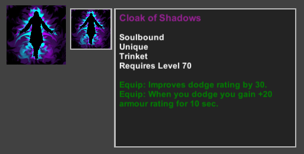

<!-- HEADER -->

<div align="center">

# Unity Tooltip System
A simple Unity implementation for tooltips UI components.

</div>

<div align="center">
  <a href="https://github.com/lottehime/Expansive-Mods-SE">
    
  </a>
</div>

<!-- BODY -->
## What does it do?
Gives you RPG game style tooltips for your in game objects, UI components, etc.

It works for 3D objects in your viewport as well as GUI components.

## How does it work?
There are 3 prefabs included:
1. ```Tooltip3DItem.prefab``` - Is an example 3D GameObject for placing in a scene that has the ```TooltipGOTrigger.cs``` attached and setup with an example text and icon.
2. ```TooltipCanvas.prefab``` - Is an example UI canvas with two demo UI items that have ```TooltipTrigger.cs``` attached and setup with example text and with ```Image``` components that have example icons. It also has the Object responsible for rendering the tooltip ```TooltipWindow``` which has ```TooltipView.cs``` attached and setup, including the sub objects.
3. ```TooltipEventSystem.prefab``` - A pre-setup Unity Event System for input, etc.

You can refer to these prefabs and the demo scene ```TooltipSystemScene.unity``` for detailed examples.

* ```TooltipGOTrigger.cs``` is used for attaching to 3D objects in your scene so that you can hover over them and produce a tooltip.
  * ```Text``` is to be filled with the text that will be rendered in the tooltip.
  * ```Tooltip Icon``` should have an icon attached to it for rendering in the tooltip.
  * ```Use Mouse Position``` can be enabled to render the tooltip based on the mouse position not a fixed offset from the object.
  * ```Offset``` can be set so that the tooltip is rendered at a certain offset from the object.

* ```TooltipTrigger.cs``` is used for attaching to UI based objects, such as skill icons so that you can hover over them and produce a tooltip.
  * ```Text``` is to be filled with the text that will be rendered in the tooltip.
  * ```Use Mouse Position``` can be enabled to render the tooltip based on the mouse position not a fixed offset from the object.
  * ```Offset``` can be set so that the tooltip is rendered at a certain offset from the object.
  * The UI object should have an ```Image``` component with the icon image to be reproduced in the tooltip (such as the skill or item icon).

* ```TooltipView.cs``` is used for controlling the objects used to render the tooltip itself.
  * ```Tooltip Text``` should have a UI Text object attached to it that is part of the canvas hierarchy, it will render the tooltip text. This should be setup however your UI needs. Refer to the demo scene for an example.
  * ```Tooltip Image``` should have a UI Image object attached to it that is part of the canvas hierarchy, it will render the tooltip icon.  This should be setup however your UI needs. Refer to the demo scene for an example.
  * ```Tooltip Offset``` can be set for a custom offset position for the tooltip to be rendered within the canvas hierarchy. This will depend on your UI setup, but will usually never be 0,0,0. Refer to the demo scene for an example.

## Ideas For Extending:
1. ```TooltipView.cs``` could be extended to take object data from a component, such as rarity, status, level, stat vs stat calcs, etc. and added to the Text string instead of having these be static like in the example.
2. Colors could be applied to the text based on object data from a component.
3. Fork the repo, add a feature you think is cool and make a pull request! 😉

<!-- BUY ME A COFFEE -->
## Help Support More Like This

<a href="https://www.buymeacoffee.com/lottehime" target="_blank"></a>

<!-- LICENSE -->
## License

Distributed under the GNU General Public License v3. See `LICENSE.txt` for more information.
